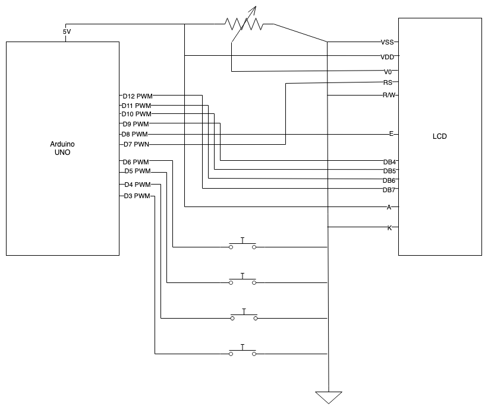

# LifeTracker

A simple project to using an Arduino Uno and a 16x2 LCD to make a MTG commander life tracker.

## TODO

* [ ] Add commander damage tracker
* [ ] Add poison counter tracker

## Schematic

